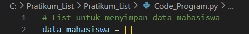

# Pratikum_List

# Langkah 1: Inisialisasi List Kosong
  Buat list kosong data_mahasiswa yang akan digunakan untuk menyimpan data setiap mahasiswa.
  
  

# Langkah 2: Memulai Loop untuk Input Data
  Memulai loop while True agar program terus meminta input data mahasiswa sampai pengguna memilih untuk berhenti.
  
  

# Langkah 3: Memasukkan Data Mahasiswa
  Di dalam loop, program meminta pengguna memasukkan nama, nilai tugas, UTS, dan UAS.
  
  

# Langkah 4: Menghitung Nilai Akhir
  Menghitung nilai akhir dengan bobot masing-masing komponen (tugas 30%, UTS 35%, dan UAS 35%).
  
  

# Langkah 5: Menyimpan Data Mahasiswa ke List
  Menyimpan data dalam bentuk dictionary dan menambahkannya ke list data_mahasiswa.
  
  

# Langkah 6: Menanyakan Apakah Ingin Menambah Data Lagi
  Menanyakan apakah pengguna ingin menambah data lagi atau tidak. Jika jawaban adalah 't', program keluar dari loop.
  
  

# Langkah 7: Menampilkan Daftar Data Mahasiswa
  Menampilkan seluruh data mahasiswa dalam format tabel setelah keluar dari loop.
  
  

# Hasil Program :
  
  

# FLOWCHART :
  
  
